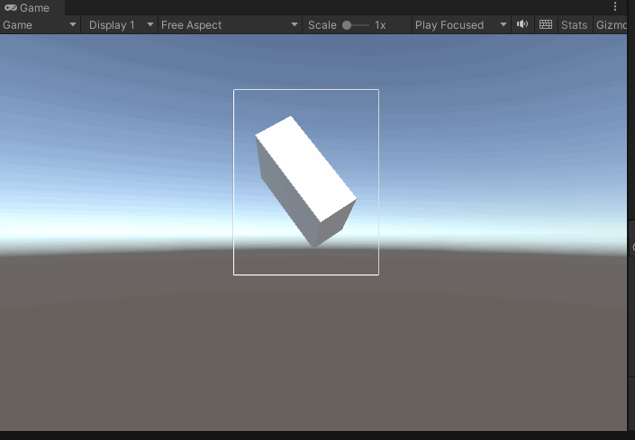

# MeshBoundViewer

这个项目实现了一个简单的 模型包围盒可视化工具，用于在 Unity 编辑器/运行时中查看模型的包围盒。

This project implements a simple model bounding box visualization tool, which is used to view the bounding box of the model in the Unity editor/runtime.

# 开发环境 / Development environment
Unity 2021.3.16f1

# 项目简介 / Introduction

1. 在 微信 公众号中发现这样一篇文章 [《Unity 如何使UI框动态包住一个三维物体》](https://mp.weixin.qq.com/s/q5kXIpaz4H-5UkPPjNoBiw), 就想把它誊抄下来，就像看看上手效果，于是就有了这个项目。

	In the WeChat public account, I found such an article [《How to make the UI box dynamically wrap a 3D object in Unity》](https://mp.weixin.qq.com/s/q5kXIpaz4H-5UkPPjNoBiw), I want to copy it down, just want to see the effect, so this project came into being.

2. 这只是一个简单的 Demo，仅仅实现了简单的模型包围盒可视化，所以不用抱太多期望，换而言之，这个项目不会介绍如何计算一组 mesh 的共有包围盒。

	This is just a simple demo, which only implements the visualization of the bounding box of a simple model, so don't expect too much. In other words, this project will not introduce how to calculate the common bounding box of a set of meshes.

3. 当然，通过这个仓库，我还想分享一下 Newbing 协助编程的快乐；用于驱动下面动图中 Cube 姿态、尺寸发生随机变化的脚本 ``RandomTransform.cs`` 便是由 Newbing 一手写就，在本项目的 doc/RandomTransform.pdf 中可以看到我和 AI 的完整对话。

	Of course, through this repository, I also want to share the joy of Newbing assisted programming; the script ``RandomTransform.cs`` used to drive the random changes in the posture and size of the Cube in the following animation GIF below is written by Newbing. In the doc/RandomTransform.pdf of this project, you can see the complete dialogue between me and AI.

看看效果还是挺有趣的。。。

You see,it's quite interesting ...

# 使用方法 / How to use

clone 本项目后，使用 对应版本的 Unity 开启即可，点击 Play 即可预览效果。

After cloning this project, use the corresponding version of Unity to open it. hit Play then there we go.

